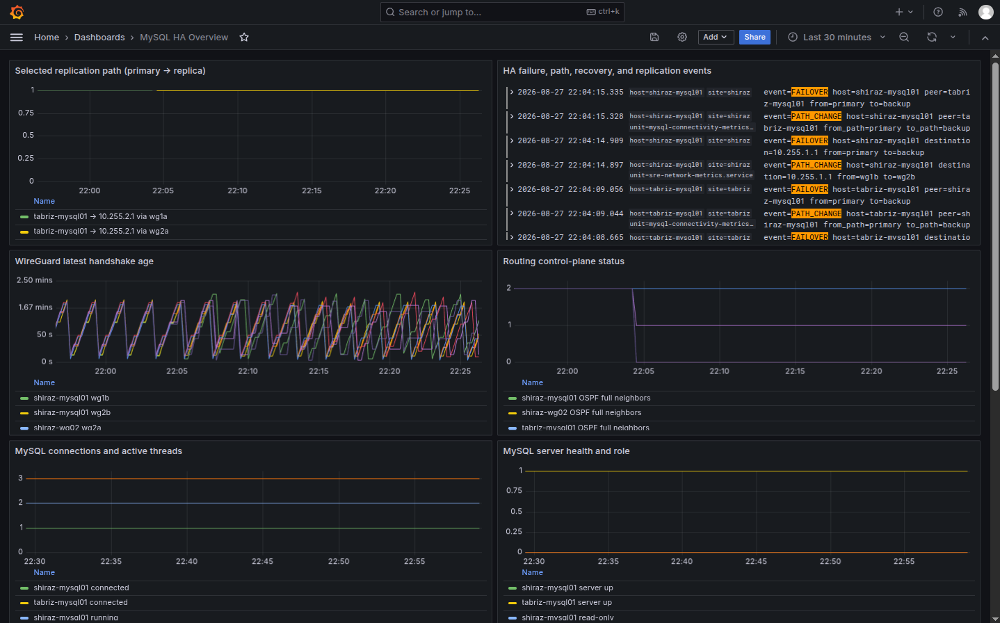

# MySQL HA Network



*Grafana overview of replication paths, WireGuard handshakes, routing status,
and HA failure/recovery events.*

```text
                         WG-1 / PRIMARY
                  +---- tabriz-wg01 ----+
                  |                     |
                  |                     |
tabriz-mysql01 ---+                     +--- shiraz-mysql01
 MySQL PRIMARY    |                     |     MySQL REPLICA
 10.255.1.1/32    +---- shiraz-wg02 ----+     10.255.2.1/32
                         WG-2 / BACKUP

                         monitor-01
               Prometheus / Grafana / Loki
```

## Overview

MySQL HA Network is an Ansible-managed, cloud-neutral infrastructure for
running a highly available MySQL service across two sites: Tabriz and Shiraz.
It combines encrypted WireGuard transport, dynamic FRRouting (FRR) with
OSPFv2 and BFD, MySQL GTID replication, and centralized monitoring and logging.

The design provides two independent network paths between the MySQL hosts. WG-1
is preferred during normal operation, while WG-2 remains available as a backup.
MySQL replication uses stable loopback addresses, so routing changes do not
require changes to the database configuration.

## Capabilities

- two independent routed paths, never a serial WG-1 -> WG-2 chain;
- WireGuard on all four point-to-point links;
- FRR with OSPFv2 for dynamic service-route selection;
- BFD plus end-to-end health checks;
- primary/backup routing with anti-flapping and controlled failback;
- MySQL GTID replication over stable loopback addresses;
- centralized monitoring, alerting, logging, diagnostics, and failure tests;
- idempotent Ansible deployment without committed secrets.

## Architecture

See [`docs/implementation-plan.md`](docs/implementation-plan.md) for the
architecture and engineering decisions, [`docs/network-design.md`](docs/network-design.md)
for the WireGuard design, and [`docs/routing.md`](docs/routing.md) for the
FRR/OSPF/BFD control plane.

## Topology

Normal operation:

```text
tabriz-mysql01 -> tabriz-wg01 -> shiraz-mysql01   ACTIVE
tabriz-mysql01 -> shiraz-wg02 -> shiraz-mysql01   BACKUP
```

WG-1 failure:

```text
tabriz-mysql01 -X- tabriz-wg01 -X- shiraz-mysql01
tabriz-mysql01 --> shiraz-wg02 --> shiraz-mysql01 ACTIVE
```

## Technology Stack

- **WireGuard**: simple, auditable encrypted point-to-point overlays.
- **FRRouting / OSPFv2**: dynamic route ownership and deterministic path cost.
- **BFD**: faster adjacency failure detection than normal OSPF dead timers.
- **Ansible**: reproducible, idempotent host configuration.
- **Prometheus / Grafana / Alertmanager**: metrics, visualization, and alerting.
- **Loki / Alloy**: centralized operational logs with site/host/component labels.

## Network Addressing

| Purpose | Addressing |
|---|---|
| Tabriz MySQL stable loopback | `10.255.1.1/32` |
| Shiraz MySQL stable loopback | `10.255.2.1/32` |
| WG-1 leg A | `10.10.1.0/30` |
| WG-1 leg B | `10.10.1.4/30` |
| WG-2 leg A | `10.10.2.0/30` |
| WG-2 leg B | `10.10.2.4/30` |

## Routing Design

WG-1 uses OSPF cost `10` on each hop (end-to-end cost `20`); WG-2 uses `100` on each hop (end-to-end cost `200`). WireGuard uses `Table = off` and narrow cryptokey selectors (peer transit `/32`, the single service `/32` reachable through that peer, and OSPF multicast `/32`s), so OSPF—not wg-quick—decides the route to the stable MySQL loopbacks. OSPF is passive by default and un-passived only on WireGuard interfaces.

## WireGuard Design

Four point-to-point links are defined in `inventory/group_vars/wireguard.yml`
and managed by `ansible/roles/wireguard`. Each interface has a target-generated
private key under `/etc/wireguard/keys/`; private keys are never committed or
embedded in the template. Each peer `AllowedIPs` includes its transit `/32`,
exactly one service `/32` needed for WireGuard cryptokey routing/source
validation, and the two OSPF multicast `/32`s. `Table = off` prevents those
selectors from installing routes, so end-to-end service-route ownership remains
with FRR/OSPF.

## MySQL Replication

The replica will connect to `10.255.1.1`, not a `10.10.x.x` transit address.
GTID, row-based binary logging, dedicated replication credentials, and
replication verification are configured by the MySQL roles.

## Failure Detection

BFD is attached to every OSPF WireGuard adjacency using a shared FRR profile.
It defaults to 500 ms transmit/receive intervals with multiplier 3, targeting
approximately 1.5-second adjacent-link detection under symmetric negotiation.
OSPF retains conservative 10/40-second hello/dead timers.

## Failover

Control-plane failures withdraw OSPF adjacencies, allowing the alternate OSPF
route to become active. Monitoring probes also expose data-plane reachability,
latency, and packet loss so that blackhole conditions are visible to operators.

## Failback

The configured path preference and recovery hold-down prevent a recovered path
from immediately displacing a stable active path.

## Anti-Flapping

Single transient probe loss does not change routing. Thresholds and hold-downs
are configurable in `inventory/group_vars/all.yml`.

## Monitoring and centralized logging

`make monitoring` deploys Prometheus, Grafana, Alertmanager, Blackbox Exporter,
Loki, and Grafana Alloy. `node_exporter` plus a textfile collector runs on all
routing and MySQL hosts. The collector exposes WireGuard handshakes and age,
route presence, selected path, OSPF full neighbors, and BFD sessions. A
least-privilege MySQL collector exposes replication thread state and lag, while
each MySQL host probes the other stable service address for ICMP/TCP
availability, latency, and packet loss. Alloy forwards service log files and
the system journal to Loki with host/site/service/component labels.

## Alerting

Alerts cover exporter/host loss, WireGuard handshakes, routes, OSPF/BFD,
monitor-originated ICMP, MySQL-to-MySQL ICMP/TCP reachability, latency, packet
loss, replication thread failures, and replication lag. Alertmanager is
configured for email and can be changed to a webhook or paging receiver.

## Logging

Loki runs on `monitor-01`; Alloy runs on every routing/MySQL node and on the
monitor itself. Search labels such as `{site="tabriz"}` or `{job="journal"}`
in Grafana Explore.

## Security

Real credentials belong in `inventory/group_vars/vault.yml`, which is ignored
by Git. Start from `vault.yml.example` and encrypt it with Ansible Vault.
When GitHub Actions deployment is enabled, store the encrypted Vault file, its
password, the deployment SSH private key, and verified SSH known-hosts entries
in a protected environment. See
[`docs/github-actions.md`](docs/github-actions.md).

## Automation

The deployment entrypoint is:

```bash
ansible-playbook -i inventory/hosts.yml ansible/site.yml
```

The same deployment is available locally as `make site`. GitHub Actions runs
Ansible lint on pull requests and deploys the complete stack after a successful
lint on `main`; deployment uses the protected `production` environment.

## Deployment

Before deployment, replace every `REPLACE_ME_*` inventory value and create the
encrypted Vault file. Deploy the complete network stack with:

```bash
make install-deps
make check
make network
```

The initial/key-rotation WireGuard run must include all four hosts in the `wireguard`/`routing` groups so Ansible can exchange derived public keys.

## Verification

Validate the network design locally:

```bash
make check
```

The checks validate the WireGuard topology, render the FRR configurations,
prove WG-1 is the unique lowest-cost route, verify that WG-2 remains available
after WG-1 removal, check BFD timer policy, and reject static MySQL service-route
selection.

## Failure Testing

Failure-injection guidance is available in
[`scripts/failures/README.md`](scripts/failures/README.md). Run failure tests
only in an environment where routing, replication, and monitoring evidence can
be collected safely.

## Operations and troubleshooting

Use [`docs/monitoring.md`](docs/monitoring.md) for observability operations and
[`docs/manual-pre-monitoring-runbook.md`](docs/manual-pre-monitoring-runbook.md)
for host-level deployment checks.

## Design notes

The main design decision is strict route ownership: WireGuard supplies encrypted
point-to-point connectivity; OSPF owns service reachability. This avoids
path-specific routes competing with the dynamic routing protocol.

## Limitations

Live tunnel, routing, replication, and monitoring acceptance depends on
environment-specific inventory values, credentials, and access to the target
hosts. The repository provides the automation and static validation required to
prepare and verify that deployment.

## Repository Structure

```text
mysql-ha-network/
├── README.md
├── Makefile
├── ansible.cfg
├── requirements.yml
├── inventory/
│   ├── hosts.yml
│   └── group_vars/
├── ansible/
│   ├── common.yml
│   ├── wireguard.yml
│   ├── frr.yml
│   ├── network.yml
│   └── roles/
├── monitoring/
├── scripts/
│   ├── validate_wireguard_topology.py
│   ├── validate_routing_design.py
│   └── failures/
├── tests/
│   ├── test_wireguard.py
│   └── test_routing.py
├── docs/
│   ├── implementation-plan.md
│   ├── network-design.md
│   ├── routing.md
│   └── rca/
└── artifacts/
```
